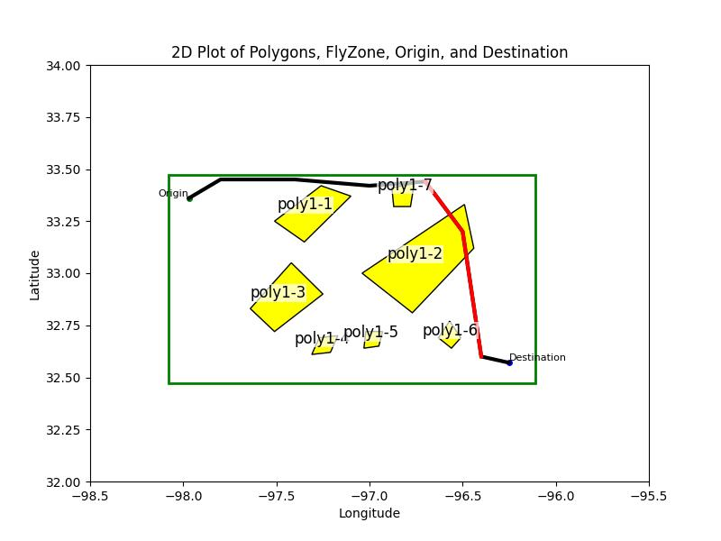

# Can LLMs Plan Flights from Scratch? A Chain-of-Thought Approach for Human-Centric Planning

This project is about using different LLMs for generating flight plans in wind hazardous areas. 

## How the Code Works

At first, the dataset file will be scanned and the place marks of interest will be extracted. Then a prompt will be generated from past experiences (short term memory + the current problem), and an LLM model will do the flight planning. The LLM response will be parsed to another kml file and an image of the flight scene will be plotted for coach agent.

After the image is stored, a coach agent which is another LLM will evaluate the planning and store its response in a short term memory file. 

## Run
`python3 main.py ${LLM_MODEL} ${DATASET_NAME} ${PLACE_MARKS} ${OUTPUT_FILE} --image_path ${FLIGHT_PLAN_IMAGE_NAME}`

## Synthetic Polygon Dataset

This dataset provides synthetic polygon configurations across three difficulty levels, along with corresponding waypoint information. It is designed for applications such as path planning, spatial analysis, and simulation of varying levels of complexity.

### Dataset Overview

- **Difficulty Modes:**
  - **Easy:** 2 polygons
  - **Medium:** 4 polygons
  - **Hard:** 7 polygons

- **Variation Details:**
  - Each difficulty mode features a unique total area.
  - The number of waypoints varies by difficulty mode.

- **Origin & Destination Points:**
  - The dataset includes 5 sets of origin and destination points.
  - These points are randomly placed on one side of the fly zone area.

