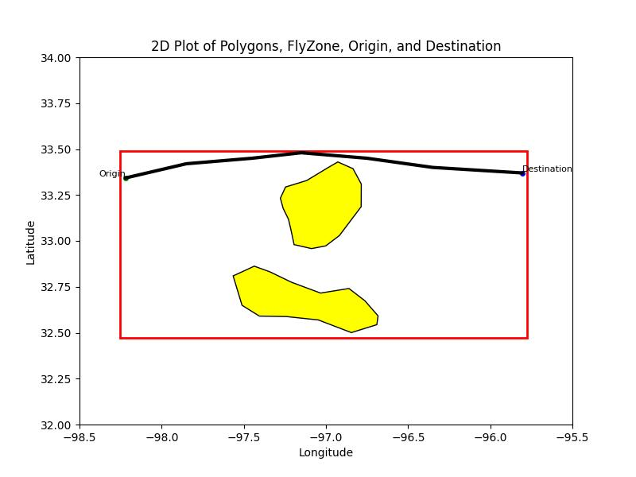

# Chain-of-Thought Flight Planner: End-to-End LLM Routing under Wind Hazards

Recent advances in LLMs have opened new possibilities for automating complex planning tasks through natural language dialogue and reasoning. In this paper, we introduce a human-centric flight planning framework that leverages an LLM with CoT prompting to generate flight plans under wind hazard constraints. Our approach keeps a human operator "in-the-loop" by eliciting their preferences via natural language and producing recommended flight plans aligned with these preferences. We integrate five different prompting strategies with a custom LLM to assess their impact on planning valid rates and alignment with operator intent. Simulation experiments are conducted on nine wind hazard scenarios (categorized by difficulty) in an advanced air mobility context. We evaluate each method in terms of plan feasibility (safety and constraint satisfaction) and how well the LLM's output matches the stated human preferences. The results demonstrate a 98% valid rate on average for the best prompting strategy and their alignment with operator goals. This work is among the first to apply LLM-based CoT reasoning for autonomous flight route planning in an end-to-end manner and highlights the potential of human-centered AI in future aviation applications.




## Run

```bash
python3 main.py ${LLM_MODEL} ${DATASET_NAME} ${PLACE_MARKS} ${OUTPUT_FILE} --image_path ${FLIGHT_PLAN_IMAGE_NAME}
```

Optional flags:
- `--rag` — enable retrieval-augmented generation
- `--rag_coach` — enable RAG with VLM coach feedback
- `--coach` — enable VLM coach (requires `--image_path`)
- `--human_review` — prompt for human feedback after planning


## Warmup Runs

Warmup experiments assess basic plan validity (hazard avoidance, flyzone containment, origin/destination reachability) across models, with and without the VLM coach. Black segments are valid; red segments intersect a hazardous polygon.

### Hard Scenario — 7 Hazard Zones (poly1)

| Model | Without Coach | With Coach |
|-------|:---:|:---:|
| **o4-mini** |  |  |
| **o3-mini** |  |  |
| **gpt-4.1** |  |  |
| **deepseek-r1** |  |  |
| **claude-haiku-4-5** |  |  |

### Medium Scenario — 4 Hazard Zones (poly4)

| Model | Without Coach | With Coach |
|-------|:---:|:---:|
| **o4-mini** |  |  |
| **gpt-4.1** |  |  |


## Ablation Runs

Ablation experiments evaluate preference alignment across three prompting strategies on the hard scenario:

- **Baseline** — no retrieval, no coach
- **RAG** — retrieval-augmented generation with similar past plans
- **RAG+Coach** — RAG with iterative VLM coach feedback

### Clearance Preference (maximize distance from hazards)

| Model | Baseline | RAG | RAG+Coach |
|-------|:---:|:---:|:---:|
| **gpt-4.1** |  |  |  |
| **o4-mini** |  |  |  |
| **o3-mini** |  |  |  |

### Waypoint Preference (minimize number of waypoints)

| Model | Baseline | RAG | RAG+Coach |
|-------|:---:|:---:|:---:|
| **gpt-4.1** |  |  |  |
| **o4-mini** |  |  |  |


## Synthetic Polygon Dataset

This dataset provides synthetic polygon configurations across three difficulty levels, along with corresponding waypoint information. It is designed for applications such as path planning, spatial analysis, and simulation of varying levels of complexity.

### Dataset Overview

- **Difficulty Modes:**
  - **Easy:** 2 polygons
  - **Medium:** 4 polygons
  - **Hard:** 7 polygons

- **Variation Details:**
  - Each difficulty mode features a unique total area.
  - The number of waypoints varies by difficulty mode.

- **Origin & Destination Points:**
  - The dataset includes 5 sets of origin and destination points.
  - These points are randomly placed on one side of the fly zone area.
